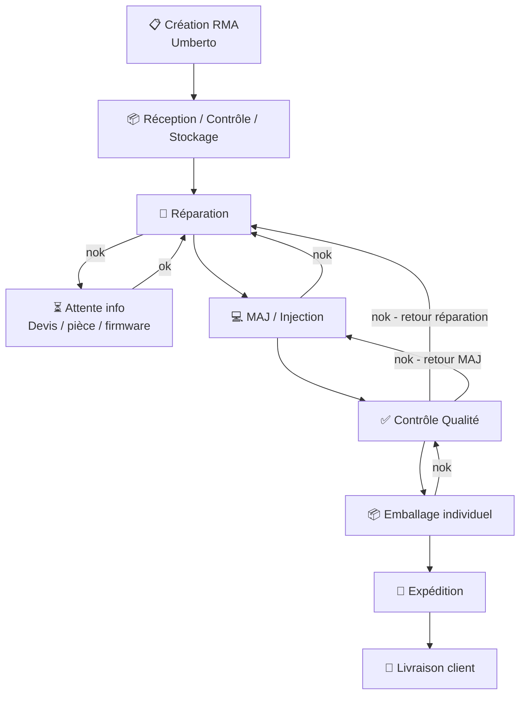
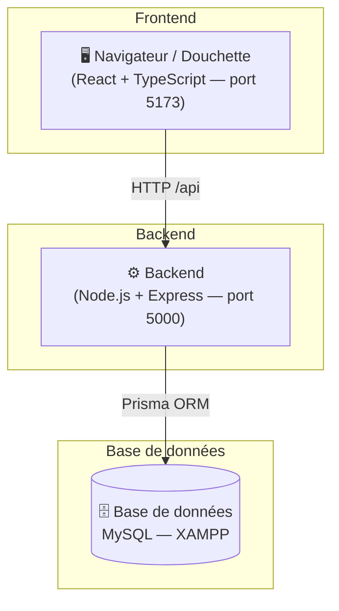

# SMAC — Suivi et Management des Ateliers et de la Chaîne logistique


---

## Contexte

SMAC est développé pour remplacer **OGI**, l'outil de gestion actuel basé sur WinDev, qui présente plusieurs limites bloquantes :

- Paramétrage en dur dans le code — non configurable sans intervention externe
- Temps de latence importants liés au langage WinDev et à la base de données
- Aucun accès externe possible (pas de visibilité client ni inter-sites)
- Inadapté à l'activité actuelle — tâches chronophages, saisies en double voire triple

SMAC est une **application web** moderne, accessible partout, conçue pour être déployée sur plusieurs sites avec un socle commun configurable.

---

## Identification des besoins

- Développement d'une base commune facilement réplicable, pour mise en place sur différents sites (MES et WMS)
- Mise en place de spécificités permettant le paramétrage complet de l'application (workflow, traitements laboratoire, etc.)
- Développement de modules fonctionnels itinérants à la plateforme utilisatrice
- Accès externe pour proactivité avec d'autres plateformes et visibilité client
- Vision globale de l'activité de production et reporting automatique, prenant en compte plusieurs indicateurs : KPI, SLA, etc.
- Sécurisation des données enregistrées

---

## Workflow — Fonctionnement du site



---

## Architecture technique



---

## Stack technique

| Technologie | Rôle |
|---|---|
| React + TypeScript | Frontend — UI composants, routing |
| Vite | Build tool — démarrage instantané, proxy API |
| Express (Node.js) | Backend — API REST |
| TypeScript | Langage commun Frontend + Backend |
| Prisma | ORM — mapping objet/relationnel |
| MySQL (XAMPP) | Base de données relationnelle |

---

## Structure du projet

```
smac-core/
├── frontend/
│   └── src/
│       ├── pages/          # Pages par module (logistique, production…)
│       └── components/     # Composants réutilisables
├── backend/
│   └── src/
│       ├── controllers/    # Logique métier
│       ├── routes/         # Définition des routes API
│       ├── middleware/      # Auth JWT, gestion erreurs
│       └── prisma/
│           └── schema.prisma  # Schéma base de données
└── README.md
```

